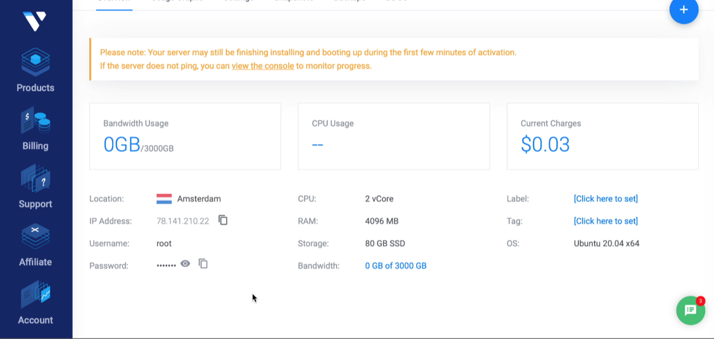

## Tube Telegram Rider

[](https://github.com/namuan/tele-tube-rider/blob/master/LICENSE) [](https://twitter.com/deskriders_twt)

Telegram Bot 🤖 to download videos from Youtube, Reddit and Twitter and send it back to you.
It uses [youtube-dl](https://ytdl-org.github.io/youtube-dl/index.html) so videos from any [supported websites](https://ytdl-org.github.io/youtube-dl/supportedsites.html) can be used.

✅ Support Youtube playlists along with a number of other websites.

### Clone project

```bash
git clone https://github.com/namuan/tele-tube-rider.git
```

### Running it locally

To run it, you'll need to create a new bot using [@botfather](https://t.me/botfather). 
Note down the *bot token* once your bot is registered.
Copy `env.cfg.sample` to `env.cfg` and set the token value for `TELEGRAM_BOT_TOKEN` variable.

```bash
cp env.cfg.sample env.cfg
```

Then we'll setup a local python virtual environment and install required dependencies.
Make sure you have `python3` installed before running the following command.

```bash
make setup
```

We also need to set up `ffmpeg` which is used to convert Video -> MP3.
On a mac, it is a single command using `brew`.

```bash
brew install ffmpeg
```

You'll find [instructions](https://ffmpeg.org/download.html) to set up on other platforms.

Next, run the bot

```bash
make run
```

If previous commands worked then this will start the bot. 
Try adding your new bot on Telegram and send a youtube video.

Here is a good one to try.
[The first 20 hours -- how to learn anything | Josh Kaufman | TEDxCSU](https://www.youtube.com/watch?v=5MgBikgcWnY)

### Self-Hosting

Although running locally is fine for testing, you may want to run it in background to avoid any disruptions.
Here is a quick guide for setting it up on a VPS or RaspberryPi (Once you get past installing ffmpeg on it 😡).

**Step 1: Setup VPS or use existing server(Raspberry Pi)**
Start a new VPS with **Ubuntu** on [Vultr](https://www.vultr.com/?ref=7306977) (Affiliate Link) or [DigitalOcean](https://m.do.co/c/da51ec30754c) (Affiliate Link).



☕️ Wait for it to come up online.

> 🧹 Remember: Clean up - Make sure you delete this server if not used to avoid incurring cost. 

**Step 2: Checking connectivity**

Once you have the server running, we'll try to connect to it.
It is better to set up a dedicated host entry as below.
Some commands in the `Makefile` assumes that the host entry matches the project directory.

> 👉 Tip: Splitting SSH Config - I used to use [poet](https://github.com/awendt/poet) to split ssh files but from [OpenSSH 7.3](http://man.openbsd.org/ssh_config#Include) it supports the `Include` directive to allow multiple ssh config files. 
> It makes it easy and manageable for working with many SSH entries

```
Host tele-tube-rider
	User root
	HostName xx.xx.xx.xx
	Port 22
	IdentitiesOnly yes
	IdentityFile ~/.ssh/dfiles
```

So if you have the above entry under ~/.ssh, running the following command will try to connect and ssh into the server.

```bash
$ make ssh
```

Make sure this works before continuing, and note that you may have to enter the Password from the VPS provider (Vultr/DigitalOcean).

**Step 3: Installing dependencies**

We also need to install a few dependencies if they are missing from the server.
The following command will take care of that.

```bash
# ssh into server
$ make server
```

**Step 4: Starting up Bot**

Again, we'll use the make command to start the bot in a screen session.

```bash
make start
```

The bot is running once the command finishes.
Try sending another Youtube video to see it in action.

**Step 5: Testing if Bot is running**

If there is anything wrong, you can see what is going on the server.

```bash
# ssh
make ssh

# check screen sessions
screen -ls

# attach to existing screen session
screen -x tele-tube-rider

# detach from a session
Ctrl + A then D
```

Make sure that you detach from screen session before leaving the server to keep the bot running.

**Step 6: [Optional] Updating Bot**

Run the following command from your local machine, and it should update the bot and restart the session automatically.

```bash
make start
```

## Credits

* [python-telegram-api](https://github.com/python-telegram-bot)
* [ffmpeg](https://ffmpeg.org/)
* [mp3splt](http://mp3splt.sourceforge.net/mp3splt_page/home.php)
* [yt2audiobot](https://github.com/gise88/yt2audiobot)
* [Telegram](https://telegram.org/)

## License

See [LICENSE](LICENSE)
